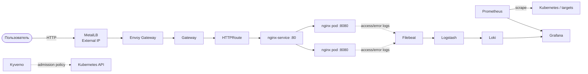

# MTS Engineer Hack — Kubernetes Platform

> Воспроизводимый single-node Kubernetes-стенд на Ubuntu 24.04: kubeadm + Ansible, публикация Nginx через Gateway API, мониторинг Prometheus/Grafana, централизованный сбор логов Filebeat/Logstash/Loki и admission-контроль Kyverno.

## Содержание

- [Архитектура](#архитектура)
- [Технологии](#технологии)
- [Требования](#требования)
- [Быстрый старт](#быстрый-старт)
- [Проверка решения](#проверка-решения)
- [Мониторинг](#мониторинг)
- [Логирование](#логирование)
- [Безопасность](#безопасность)
- [Дополнительные возможности](#дополнительные-возможности)
- [Ограничения](#ограничения)

## Архитектура



### Потоки данных

**HTTP:** `Client → MetalLB → Envoy Gateway → Gateway/HTTPRoute → Service → Nginx pods`

**Метрики:** `Kubernetes/targets → Prometheus → Grafana`

**Логи:** `Nginx container logs → Filebeat → Logstash → Loki → Grafana`

Решение рассчитано на лабораторный single-node стенд: control-plane одновременно запускает пользовательские workloads. Такой вариант уменьшает требования к инфраструктуре и упрощает воспроизведение экспертами.

## Технологии

| Компонент | Реализация |
|---|---|
| ОС | Ubuntu 24.04 |
| Kubernetes | **v1.37.0** |
| Bootstrap | kubeadm |
| Runtime | containerd, systemd cgroups |
| CNI | Flannel |
| Автоматизация | Ansible |
| External IP | MetalLB **v0.16.1**, L2 mode |
| Gateway API | Kubernetes Gateway API **v1.4.1** |
| Gateway Controller | Envoy Gateway **v1.6.3** |
| Demo application | `nginxinc/nginx-unprivileged:stable-alpine`, 2 replicas |
| Monitoring | Prometheus + Grafana |
| Logging | Filebeat → Logstash → Loki → Grafana |
| Policy as Code | Kyverno |

> Для максимально детерминированной установки в production-подобном окружении следует закрепить версии всех Helm charts и remote manifests. В текущем bootstrap Kubernetes зафиксирован v1.37.0, MetalLB — v0.16.1.

## Что реализовано

Проект автоматически подготавливает Linux-узел, разворачивает Kubernetes через kubeadm, устанавливает сетевой слой и внешний L2 IP, создаёт Nginx Deployment/Service и публикует приложение через Gateway API. Отдельные компоненты обеспечивают мониторинг, централизованное логирование и admission security.

Nginx запускается в двух репликах и имеет readiness/liveness probes, requests/limits и hardened `securityContext`. Для внешнего доступа используется не legacy Ingress, а Gateway API. Пароль `sudo` не хранится в Git и передаётся Ansible через переменную окружения `ANSIBLE_PASS`.

## Требования

### Управляющая машина

- Linux / macOS / WSL;
- Git;
- Ansible;
- SSH-доступ к целевому узлу.

### Kubernetes node

- Ubuntu 24.04;
- минимум 2 vCPU, рекомендуется 4 vCPU;
- минимум 4 GB RAM, рекомендуется 8 GB для полного observability stack;
- пользователь с `sudo`;
- доступ в Интернет для загрузки пакетов, images и manifests;
- свободный диапазон LAN-адресов для MetalLB.

## Быстрый старт

### 1. Клонировать репозиторий

```bash
git clone https://github.com/Kurg4ch/mts-devops.git
cd mts-devops/ansible
```

### 2. Настроить inventory

`inventory.ini`:

```ini
[k8s]
node1 ansible_host=<NODE_IP> ansible_user=<SSH_USER>
```

### 3. Настроить MetalLB

`group_vars/all.yml`:

```yaml
ansible_become_password: "{{ lookup('env', 'ANSIBLE_PASS') }}"
ipaddressPool: "192.168.0.200-192.168.0.220"
interface: "enp0s8"
```

Укажите свободный диапазон вашей L2-сети и реальное имя сетевого интерфейса узла.

### 4. Передать sudo-пароль без сохранения в Git

```bash
read -s ANSIBLE_PASS
export ANSIBLE_PASS
```

### 5. Проверить SSH/Ansible и запустить deployment

```bash
ansible -i inventory.ini k8s -m ping
ansible-playbook -i inventory.ini playbook.yml
```

После завершения playbook дальнейшая ручная сборка Kubernetes-ресурсов не требуется.

## Проверка решения

### Kubernetes

```bash
kubectl get nodes -o wide
kubectl get pods -A
```

Ожидается `Ready` у node и `Running/Completed` у системных компонентов.

### Nginx

```bash
kubectl get deployment nginx-deployment
kubectl get pods -l app=nginx -o wide
kubectl get svc nginx-service
```

Ожидается `2/2` доступных реплики. Service принимает трафик на `80/TCP` и направляет его на контейнерный порт `8080`.

### Gateway API

```bash
kubectl get gatewayclass
kubectl get gateway -A
kubectl get httproute -A
```

Для Gateway ожидается успешное программирование controller'ом, для HTTPRoute — принятие маршрута.

Получить внешний адрес:

```bash
kubectl get svc -A | grep LoadBalancer
```

Проверить HTTP-трафик через Gateway:

```bash
curl -v http://<GATEWAY_EXTERNAL_IP>/
```

Если маршрут использует hostname:

```bash
curl -v -H 'Host: <APP_HOST>' http://<GATEWAY_EXTERNAL_IP>/
```

## Мониторинг

Prometheus используется как обязательная система мониторинга, Grafana — как UI для визуализации. Для первичной проверки достаточно подтвердить доступность target и выполнить PromQL-запрос.

```bash
kubectl get pods,svc -n monitoring
```

Определите имя сервиса Prometheus и выполните port-forward:

```bash
kubectl port-forward -n monitoring svc/<PROMETHEUS_SERVICE> 9090:9090
```

В Prometheus выполните:

```promql
up
```

Работающий target должен иметь значение `1`. Для Grafana:

```bash
kubectl port-forward -n monitoring svc/<GRAFANA_SERVICE> 3000:80
```

После этого Grafana доступна по адресу `http://localhost:3000`. Имя пользователя — `admin`.

### Получение пароля Grafana

Пароль администратора **не хранится в README или Ansible-переменных в открытом виде**. Он находится в Kubernetes Secret в namespace `monitoring`.

Сначала найдите Secret Grafana:

```bash
kubectl get secrets -n monitoring | grep grafana
```

Затем получите пароль из ключа `admin-password`:

```bash
kubectl get secret -n monitoring <GRAFANA_SECRET> \
  -o jsonpath="{.data.admin-password}" | base64 --decode; echo
```

Например, если Secret называется `prometheus-grafana`:

```bash
kubectl get secret -n monitoring prometheus-grafana \
  -o jsonpath="{.data.admin-password}" | base64 --decode; echo
```

После получения пароля войдите в Grafana с логином `admin`. Такой подход позволяет не хранить учетные данные Grafana в открытом виде в Git-репозитории.

## Логирование

Цепочка централизованного логирования:

```text
Nginx container logs
        ↓
     Filebeat
        ↓
     Logstash
        ↓
       Loki
        ↓
     Grafana
```

Проверка компонентов:

```bash
kubectl get pods,svc -n logging
```

Сгенерировать новый access-log:

```bash
curl http://<GATEWAY_EXTERNAL_IP>/
```

Убедиться, что Nginx сформировал запись:

```bash
kubectl logs deployment/nginx-deployment --tail=20
```

После этого в **Grafana → Explore → Loki** найти свежую запись HTTP-запроса. Таким образом проверяется не только наличие Filebeat, но и прохождение события по всей цепочке до централизованного хранилища.

## Безопасность

### Hardened Nginx workload

Контейнер запускается без root и без возможности повышения привилегий:

```yaml
securityContext:
  runAsNonRoot: true
  allowPrivilegeEscalation: false
  readOnlyRootFilesystem: true
  capabilities:
    drop:
      - ALL
  seccompProfile:
    type: RuntimeDefault
```

Дополнительно заданы CPU/RAM requests/limits, readiness/liveness probes, а `/tmp` вынесен в `emptyDir` для совместимости с read-only root filesystem.

Проверка UID:

```bash
kubectl exec deployment/nginx-deployment -- id
```

Проверка read-only root filesystem:

```bash
kubectl exec deployment/nginx-deployment -- touch /should-fail
```

Вторая команда должна завершиться ошибкой записи.

### Kyverno — Policy as Code

Kyverno устанавливается в кластер и применяет `ClusterPolicy` `disallow-privileged-containers` в режиме:

```yaml
validationFailureAction: Enforce
```

Политика запрещает создание privileged-контейнеров в namespace `default`.

Проверка:

```bash
kubectl get clusterpolicy
```

Негативный тест:

```bash
kubectl run privileged-test \
  --image=nginx:alpine \
  --overrides='{"spec":{"containers":[{"name":"privileged-test","image":"nginx:alpine","securityContext":{"privileged":true}}]}}'
```

API server должен отклонить создание Pod политикой Kyverno.

## Дополнительные возможности

Помимо обязательной части кейса, в архитектуре используются практики, полезные для эксплуатации:

- **MetalLB L2** — внешний IP для Gateway в bare-metal/VM окружении без cloud LoadBalancer;
- **две реплики Nginx** — демонстрация балансировки между backend pods;
- **health probes** — Kubernetes может исключать неготовый pod и перезапускать нездоровый;
- **resource requests/limits** — базовый контроль потребления CPU/RAM;
- **container hardening** — non-root, read-only rootfs, seccomp, drop capabilities;
- **Kyverno Enforce** — предотвращение небезопасной конфигурации до создания workload;
- **централизованный поиск логов** через Loki/Grafana.

## Ограничения

1. Стенд single-node и не обеспечивает HA control plane.
2. Control-plane taint снимается намеренно, чтобы запускать workloads на единственном узле.
3. MetalLB работает в L2 и требует свободного адресного пула в локальной сети.
4. Flannel выбран как простой CNI для лабораторного стенда; полноценный NetworkPolicy enforcement в production целесообразно строить на Cilium/Calico.
5. TLS не является частью базового маршрута; для production необходимо добавить HTTPS/cert-manager и закрыть административные UI.
6. Persistence/backup observability-компонентов требует отдельного production-дизайна.
7. Для строгой воспроизводимости следует закрепить версии всех Helm charts и remote manifests вместо `latest`.

## Структура репозитория

```text
mts-devops/
├── README.md
└── ansible/
    ├── inventory.ini
    ├── group_vars/
    │   └── all.yml
    ├── playbook.yml
    └── roles/
        ├── common/       # подготовка Ubuntu/containerd
        ├── kubernetes/   # kubeadm, Flannel, MetalLB, Kyverno
        ├── nginx/        # demo workload + Service
        ├── gateway/      # Gateway API / Envoy Gateway
        ├── prometheus/   # monitoring stack
        ├── logging/      # Filebeat / Logstash / Loki
        └── security/     # дополнительные security-механизмы
```

## Короткий чек-лист эксперта

```bash
# Kubernetes
kubectl get nodes
kubectl get pods -A

# Application
kubectl get deploy,pods,svc

# Gateway API
kubectl get gatewayclass,gateway,httproute -A
curl http://<GATEWAY_EXTERNAL_IP>/

# Monitoring
# Prometheus query: up

# Logging
curl http://<GATEWAY_EXTERNAL_IP>/
kubectl logs deployment/nginx-deployment --tail=20
# Grafana -> Explore -> Loki

# Security
kubectl get clusterpolicy
kubectl exec deployment/nginx-deployment -- id
```

---

**Repository:** https://github.com/Kurg4ch/mts-devops
